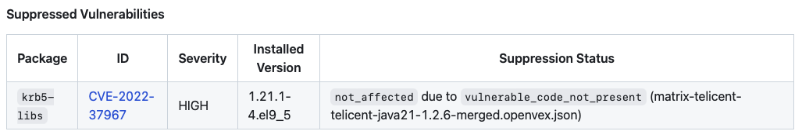

# Trivy Action

This repository provides a GitHub Action that wraps our standard patterns of usage of the [Aqua Security Trivy
Action][1], [Aqua Security Setup Trivy Action][2] and [Trivy Cache Action][3] into a composite action so we can simplify
our workflows and standardise improvements to how we surface Trivy scan information in our builds.

# Usage

At its most basic the action is used as follows:

```yaml
name: Trivy Scan Example
on: 
  push:
  workflow_dispatch:

jobs:
  example:
    runs-on: ubuntu-latest
    permissions:
      id-token: write
      contents: read

    steps:
      # Normal Job setup steps happen...
     
      # Run a Trivy Filesystem Scan
      - name: Trivy Filesystem Scan
        uses: telicent-oss/trivy-action@v1
        with:
          scan-type: fs
          scan-ref: .
          scan-name: maven-poms
          uses-java: true

      # Some more build steps that generate a Docker image...

      # Run a Trivy Image Scan
      - name: Trivy Image Scan
        uses: telicent-oss/trivy-action@v1
        with:
          scan-type: image
          scan-ref: telicent/some-image@1.2.3
          scan-name: some-image
          uses-java: true
```

In the above example we invoke the action twice, once to do a `fs` scan and another to do an `image` scan.

## VEX Support

This action now includes built-in support for processing of Vulnerability Exploitability Exchange (VEX) statements in
OpenVEX JSON format.  OpenVEX statements may be provided in two ways:

- Local statements from a `.vex/` directory in the working directory.
- Remote statements from a `.vex/` directory in one/more remote repositories configured via the optional `remote-vex`
  input, see [Remote VEX Statements](#remote-vex-statements)

All discovered OpenVEX statements are merged toegether using the [`vexctl`][4] tool to create a single VEX statements
file for the scan, this will be attached to the build as an artifact named `<scan-name>-merged-vex-statements` so it can
be reviewed if needed.

Any vulnerabilities that are suppressed as a result will be displayed in the GitHub Build Summary and listed in the full
Trivy JSON Report:



### Remote VEX Statements

When the `remote-vex` input is given, it is a new line separated list of repository references in the form
`<owner>/<repo>`, optionally with an `@<branch>` suffix if the VEX statements are not on the `main` branch e.g. you use
a different default branch name.

For each remote repository reference the action will do a sparse git clone of the `.vex/` directory, copy those files
into a shared `.remote-vex/` directory, and then merge those with any local VEX statements.  The following example shows
this in action:

```yaml
name: Remote VEX Example
on: 
  push:
  workflow_dispatch:

jobs:
  example:
    runs-on: ubuntu-latest
    permissions:
      id-token: write
      contents: read

    steps:
      # Normal Job setup steps happen...
     
      # Run a Trivy Image Scan
      - name: Trivy Image Scan
        uses: telicent-oss/trivy-action@v1
        with:
          scan-type: image
          scan-ref: telicent/some-image@1.2.3
          scan-name: some-image
          uses-java: true
          remote-vex: |
            telicent-oss/telicent-base-images
            telicent-oss/smart-caches-core
```

Here we are configuring the action to retrieve remote VEX statements from the `telicent-oss/telicent-base-images` and
`telicent-oss/smart-caches-core` repositories `main` branches.

Note that if any of the specified repositories does not exist, does not have the referenced branch, or no `.vex/`
directory exists on that branch then a build warning is issued e.g.


# Inputs

| Input | Required? | Default | Purpose |
|-------|-----------|---------|---------|
| `scan-type` | Yes | N/A | Specifies the kind of Trivy scan to run, one of `fs`, `image`, `config` or `sbom` |
| `scan-ref` | Yes | N/A | Specifies what to scan, for `scan-type` of `fs`/`sbom` this is a file system path, for `image` this is a reference to a container image, for `config` this is a reference to a Dockerfile |
| `scan-name` | Yes | N/A | A unique name (within the calling workflow) for this scan used to disambiguate the scan artifacts when they are attached as artifacts to the build. |
| `uses-java` | No | `false` | If your scans involve Java code, whether for `fs` or `image` scans, then set this to `true` to ensure the Trivy Java DB is additionally downloaded and cached |
| `remote-vex` | No | `null` | If your scans involved building atop of libraries/base images provided in other repositories you can supply one/more references to repositories here from which VEX statements will be retrieved, see [VEX Support](#vex-support). |
| `allow-unfixed` | No | `false` | Sets the `ignore-unfixed` input passed on to the [`aquasecurity/trivy-action`][1] that controls whether unfixed HIGH/CRITICAL severity vulnerabilities fail the build. |
| `gh-token` | No | `github.token` | Sets the GitHub token used to authenticate to GitHub to fetch Trivy release metadata to determine whether the cache needs updating. |

# Outputs

| Output | Description |
|--------|-------------|
| `scan-results` | Name of a GitHub Actions artifact that has been uploaded and contains the full Trivy JSON results. |
| `scan-results-file` | Name of the Trivy JSON file within the uploaded GitHub Actions artifact. |
| `scan-results-url` | Full URL to the uploaded artifact. |

# License

This Action is licensed under the Apache License 2.0, see [LICENSE](LICENSE) and [NOTICE](NOTICE) for more information.

[1]: https://github.com/aquasecurity/trivy-action
[2]: https://github.com/aquasecurity/setup-trivy
[3]: https://github.com/yogeshlonkar/trivy-cache-action
[4]: https://github.com/openvex/vexctl
